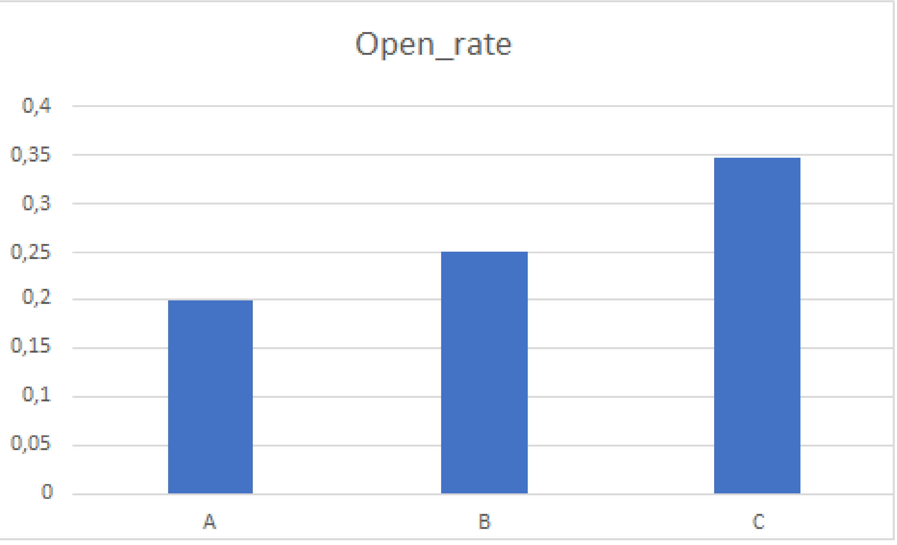
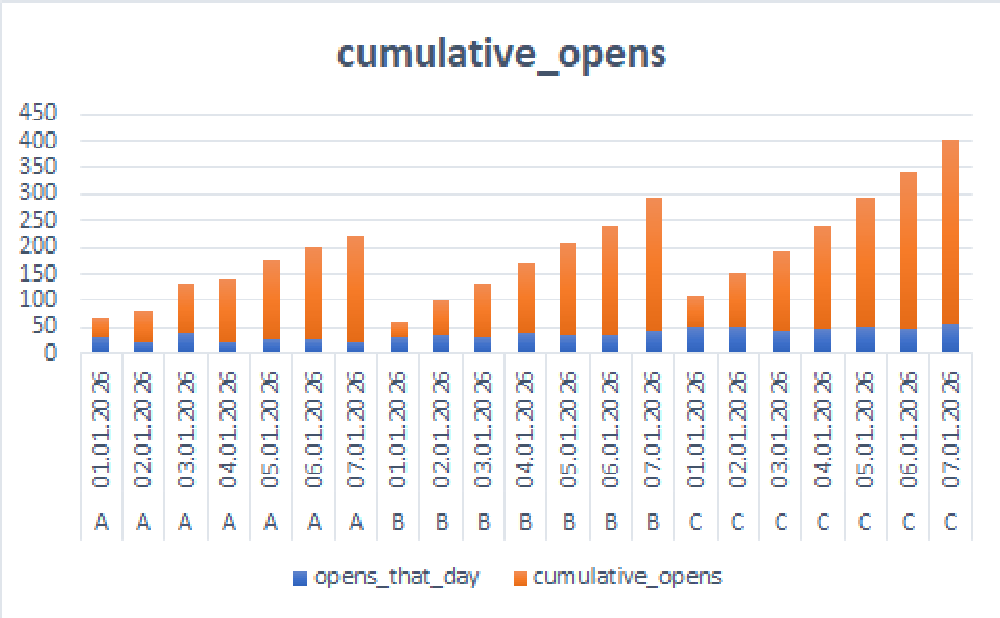

# Push Notification A/B/C Test: ANOVA & SQL Window Functions

## TL;DR

A/B/C-тест трёх вариантов пуш-уведомлений: от SQL-агрегации (с оконными 
функциями) до ANOVA и post-hoc анализа. Вариант C показал статистически 
значимо более высокий open rate по сравнению с обоими остальными вариантами.

## Задача

Тестируем 3 варианта текста пуш-уведомления (группы A, B, C) по метрике 
open rate — доле пользователей, открывших уведомление.

## Пайплайн

1. **Генерация данных** — синтетический датасет: 3000 пользователей, 
   разделённых на 3 группы (Excel)
2. **SQL — базовая агрегация** — LEFT JOIN + GROUP BY, вычисление open 
   rate на пользователя
3. **SQL — оконные функции** — ранжирование событий внутри группы 
   (ROW_NUMBER), накопительная сумма открытий по дням (SUM() OVER)
4. **Проверка распределения по группам** — SQL-запрос подтвердил равное 
   распределение пользователей (1000/1000/1000)
5. **ANOVA** — проверка, есть ли различие хотя бы между одной парой групп
6. **Post-hoc (Бонферрони)** — попарные сравнения, чтобы понять, какие 
   именно группы отличаются
7. **Итоговая рекомендация**

## Результат

ANOVA показала статистически значимое различие между группами 
(F=87.76, p<<0.05). Post-hoc анализ с поправкой Бонферрони подтвердил: 
все три варианта значимо отличаются друг от друга по open rate.

| Группа | Open rate |
|---|---|
| A | ~20% |
| B | ~25% |
| C | ~35% |

Полный отчёт: [report/final_report.md](report/final_report.md)

## Ключевые методологические решения

- **ANOVA, а не три отдельных t-теста напрямую** — сравнение более 
  двух групп требует единого теста, чтобы не раздувать общий риск 
  ложного срабатывания
- **Поправка Бонферрони на post-hoc** — раз ANOVA показал различие, 
  но не указывает, между какими именно группами; без поправки риск 
  ложной значимости накапливается при множественных сравнениях
- **Оконные функции в SQL** — показывают навык более продвинутой 
  агрегации (ранжирование и накопительные суммы внутри партиций), 
  не только базовый GROUP BY

## Как запустить

1. Откройте `data/users.csv` и `data/events.csv` в DB Browser for SQLite
2. Выполните запросы из `sql/01_aggregate_metrics.sql` и 
   `sql/03_window_functions.sql`
3. Результат — `data/user_metrics.csv`
4. Статистический анализ — `analysis/statistical_tests.xlsx`
5. Сверка на Python — `notebooks/python_check.ipynb`

## Технологии

SQL (SQLite, оконные функции, подзапросы), Excel (F.ОБР, дисперсионный 
анализ), Python (scipy.stats.f_oneway, statsmodels)

## Что можно улучшить

- Тест Тьюки вместо Бонферрони для более точного контроля ошибки
- Анализ гетерогенности эффекта по сегментам
- Проверка novelty-эффекта на более длинном периоде теста
open_rate_comparison.png
